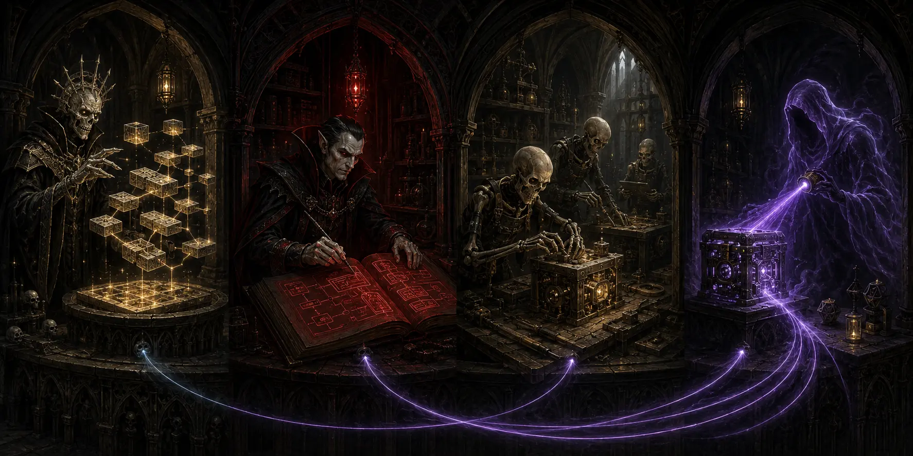

# Adeptus Necroneerium

> Progressive code construction for substantial software work: shape the architecture, define executable contracts, build bounded units, and verify the real result.

Adeptus Necroneerium is a strictly opt-in Codex plugin and coding skill for work that is too large, interconnected, or evolution-heavy for a reliable one-shot implementation.

It gives Codex a lightweight hierarchy of responsibilities—**Lich, Vampire, Skeleton, and Shade**—but keeps every layer pointed at the codebase. Strategic work shapes real structure. Tactical work creates executable contracts and test skeletons. Implementation completes bounded units. Review verifies behavior and routes defects back to the lowest responsible level.

**The goal is not more agents or more ceremony. The goal is better software with less drift, rework, false confidence, and user reprompting.**

## Why this exists

Large coding tasks often fail in predictable ways: architecture is decided before the whole request is understood, plans never become useful code, implementation drifts across subsystems, and passing tests are mistaken for proof that the actual product works.

Adeptus Necroneerium tests a different model:

| Common failure mode | Adeptus response |
| --- | --- |
| Planning is detached from implementation | Higher layers produce code structure, contracts, schemas, and tests |
| Early architecture becomes an immutable decree | Lich and Vampire outputs are revisable drafts |
| A local success is reported as project completion | Every binding acceptance item must be directly verified |
| A defect causes a broad restart | Shade routes repair to the lowest responsible scope |
| Context is repeatedly reloaded | Each responsibility receives only the context it needs |
| Process overhead overwhelms small tasks | Direct and Tactical modes collapse unnecessary layers |

The governing principle is simple:

> **Working code over comprehensive agent artifacts.**

## How it works



| Responsibility | Resolution | What it contributes |
| --- | --- | --- |
| **Lich** | Whole project | Reads the complete request, shapes repository and module topology, establishes public seams, and defines coherent subsystem scopes |
| **Vampire** | One subsystem | Writes signatures, types, schemas, exceptions, docstrings, test skeletons, and acceptance-to-evidence mappings |
| **Skeleton** | Bounded unit | Implements cohesive production behavior and the tests needed to validate it |
| **Shade** | Every gate | Independently reviews observed behavior, rejects unverified claims, routes repairs backward, and may recall a retired Vampire |

Codex remains the orchestrator throughout. The role names describe responsibilities; they do not require roleplay, separate personalities, or an agent call for every file.

The ownership model is hierarchical, but real software dependencies may form a DAG. Codex schedules dependency-ready work, preserves unaffected passed scopes, and reopens only the branch invalidated by new evidence.

## Three operating modes

Adeptus chooses the lightest safe workflow **after explicit invocation**:

| Mode | Best fit | Shape |
| --- | --- | --- |
| **Direct** | Tiny or mechanical changes | Inspect → implement → test → verify |
| **Tactical** | A bounded feature with meaningful contracts | One Vampire → bounded Skeleton work → Shade gates |
| **Adeptus** | Large, phased, multi-subsystem, or structurally ambiguous work | One Lich → multiple Vampire scopes → Skeleton armies → phase and project review |

Small work should not pay the cost of a full hierarchy. Large work should spend structure only where it can prevent rework, missed requirements, architectural drift, or another user correction loop.

## What makes the review different

Shade does not merely ask whether generated unit tests passed. It checks the boundary being claimed:

- public API, CLI, UI, persistence, restart, and process behavior where relevant;
- shared state across interfaces and whether read-only operations accidentally mutate it;
- background work that must survive beyond the request or command that started it;
- README commands executed from their documented working directory;
- every binding acceptance item classified as `verified`, `failed`, or `unverified`.

`failed` and `unverified` both prohibit project PASS.

When review finds a critical defect, the repair is routed to the lowest responsible level—Skeleton implementation, Vampire contract, Lich topology, or an actual missing user requirement. Each stable finding receives its own retry history, and unrelated passed work remains intact.

## Invocation

The skill never activates implicitly. Invoke it by name:

```text
Use @adeptus-necroneerium to implement this request:

<complete software request, constraints, and acceptance criteria>
```

The registered skill name is `adeptus-necroneerium`. The repository and prompt alias may also use `adeptus_necroneerium`; the native `$adeptus-necroneerium` form is equivalent.

## Development and installation

This repository is a Codex plugin package. After registering it in a personal Codex marketplace, install or refresh it with:

```text
codex plugin add adeptus-necroneerium@personal --json
```

On Windows, the repository verifier can synchronize a checked-out package into the registered plugin and validate the result:

```powershell
.\verify-adeptus-update.ps1 -Repair
```

Without `-Repair`, the verifier is read-only and reports repository, test, and installation drift.

## Repository map

| Path | Purpose |
| --- | --- |
| `skills/adeptus-necroneerium/SKILL.md` | Installed skill entrypoint and complete operating rules |
| `skills/adeptus-necroneerium/roles/` | Focused Lich, Vampire, and Shade responsibilities |
| `skills/adeptus-necroneerium/templates/spec.md` | Optional compact working-state template for substantial runs |
| `docs/manifesto.md` | Canonical doctrine and hierarchy |
| `docs/charter.md` | Purpose, boundaries, and evaluation criteria |
| `docs/skill-outline.md` | Detailed lifecycle and repair model |
| `.codex-plugin/plugin.json` | Plugin manifest |
| `tests/test_skill_contract.py` | Regression checks for the lightweight, code-producing hierarchy |
| `verify-adeptus-update.ps1` | Repository-derived Windows installation verifier |

## Development verification

From the repository root:

```text
python3 -m unittest discover -s tests -v
python3 -m compileall -q tests
```

On Windows, `py -3` may replace `python3`. Plugin maintainers should also run the current plugin and skill validators supplied with their Codex development environment.

## Project status

Adeptus Necroneerium is an active experiment, not a claim that hierarchy automatically improves coding. It must earn its cost through practical results: stronger acceptance coverage, better evolvability, fewer false PASS claims, less rework, and fewer user interventions at a reasonable total token cost.

If controlled testing cannot show a meaningful advantage over plain Codex for any useful class of work, the correct outcome is to simplify or abandon the process.

Read the [manifesto](docs/manifesto.md) for the doctrine, the [charter](docs/charter.md) for the evaluation standard, or the [complete skill](skills/adeptus-necroneerium/SKILL.md) for operational details.
