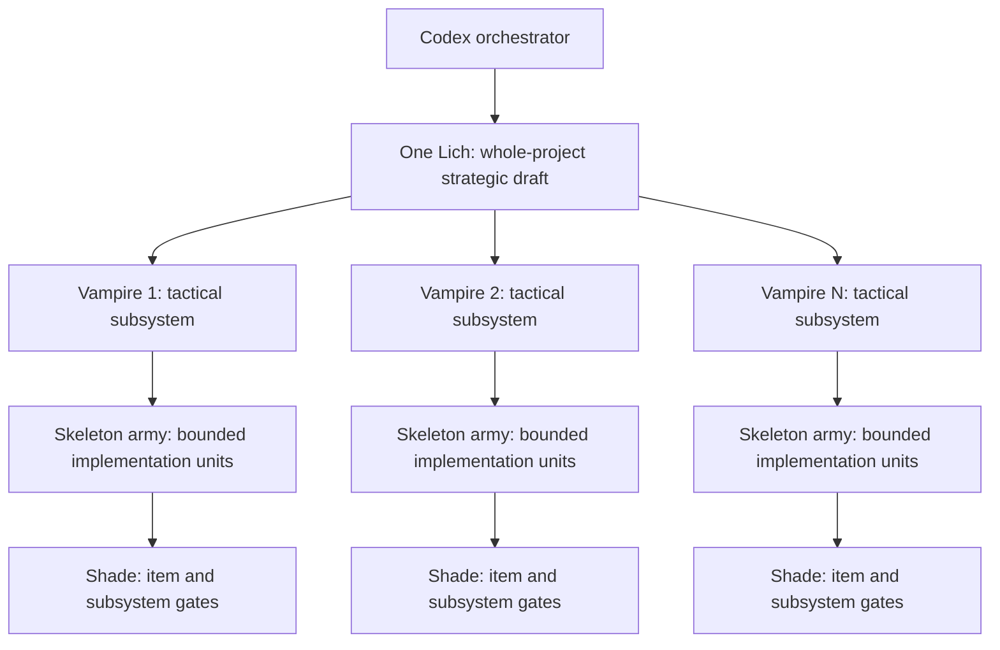

# Adeptus Necroneerium Manifesto

Adeptus Necroneerium exists to test whether hierarchical draft-guided coding can produce better software with fewer user corrections and reasonable total token cost than plain Codex.

It is not a council, roleplay system, or excuse for agent bureaucracy. Codex is the orchestrator. Lich, Vampire, Skeleton, and Shade name responsibilities inside a coding workflow.

## The hierarchy

The diagram is a tree of responsibility, not a claim that software dependencies are a tree. Dependencies among Vampire scopes and Skeleton assignments may form a DAG that Codex schedules from the Lich draft.

## Doctrine

1. **Codex orchestrates the complete request.** Codex owns progression, dependency scheduling, recalls, phase gates, and terminal status.
2. **One Lich sees the whole and shapes real code.** The singular Lich reads every requested phase, drafts the entire project in breadth, and creates or revises the repository structure and strategic code seams before tactical implementation begins.
3. **One Lich may establish many code-producing Vampires.** Each Vampire owns one coherent tactical subsystem, writes its executable contracts and skeletons, and may command many Skeleton assignments.
4. **Higher-level work is a draft, not a decree.** Lich and Vampire outputs guide downstream work but remain open to evidence-driven revision.
5. **Freedom to revise carries an obligation to propagate.** Lower responsibilities need no routine permission to improve a draft, but must update affected contracts, tests, dependencies, and validation state.
6. **User outcomes outrank internal drafts.** Explicit requirements, acceptance criteria, safety constraints, and phase gates are binding unless the user changes them.
7. **Breadth precedes depth.** Lich covers the complete product shallowly; each Vampire adds tactical depth; each Skeleton completes a bounded implementation unit.
8. **Construction moves forward by default.** Passing a known item returns control to Codex, which activates the next dependency-ready item without asking a parent a question already answered.
9. **Review routes backward only with evidence.** Shade sends a defect to the lowest responsible level and preserves unaffected work.
10. **Retired Vampires can be recalled.** Shade may recall a tactical scope for a verified critical or integration defect; Lich may require recall after strategic revision. Recall preserves scope and retry identity.
11. **Shade reviews every resolution.** Skeleton behavior, Vampire subsystem integration, phase gates, and the final product each receive evidence-based judgment.
12. **A local PASS is not project PASS.** Codex continues until every requested acceptance item and gate passes, a genuine external blocker prevents progress, or one finding fails after retry 2.
13. **Working code outranks agent artifacts.** Plans and handoffs exist only when downstream implementation or review uses them.
14. **Spend tokens to prevent rework, not to describe work.** Structure is justified when it reduces drift, missed requirements, false claims, reimplementation, or user reprompting.
15. **Quality and total token efficiency outrank speed.** Maximum parallelism and fastest completion are not goals; neither is arbitrary frugality that omits necessary code or verification.
16. **Claims require direct evidence.** Tests, UI, CLI, API, process handling, persistence, documentation commands, and cleanup must be checked at the boundary being claimed.
17. **Adeptus must prove its value.** Compare it against plain Codex. If it cannot improve quality, evolvability, review honesty, or total interaction cost on practical tasks, simplify or abandon it.

## Draft discipline

Drafts should function as strong, useful defaults. They must not become rigid bureaucracy, and they must not become disposable prose.

A lower responsibility may change a draft without waiting for its parent when evidence supports the change. Material consequences must be propagated. A normal draft revision is not a repair retry; Shade rejection is what begins the isolated retry sequence.

## Vampire lifecycle

Codex normally activates one dependency-ready Vampire at a time. The Vampire drafts its subsystem, its Skeleton army implements it, and Shade reviews both the individual items and their integration. On PASS, Codex retires that Vampire and activates the next ready scope.

Retirement means inactive, not sealed. A recalled Vampire receives a compact updated context containing its stable scope, current strategic draft, prior tactical draft, direct finding evidence, retry state, affected descendants, and revalidation conditions. Unrelated project history and passed sibling work remain outside the recall.

## Cost discipline

Hierarchy is not automatically efficient. It becomes waste when roles repeatedly restate the specification, fragment trivial work, reload full context, or narrate implementation instead of doing it.

Use the lightest mode that safely completes the request. Keep strategic and tactical drafts compact. Combine tiny Skeleton assignments. Make Shade evidence concise but real. Reuse unaffected work. A large task may justify meaningful upfront framing when that investment prevents later rework and user intervention; a small task should not pay the same price.
